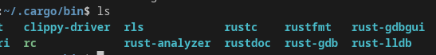
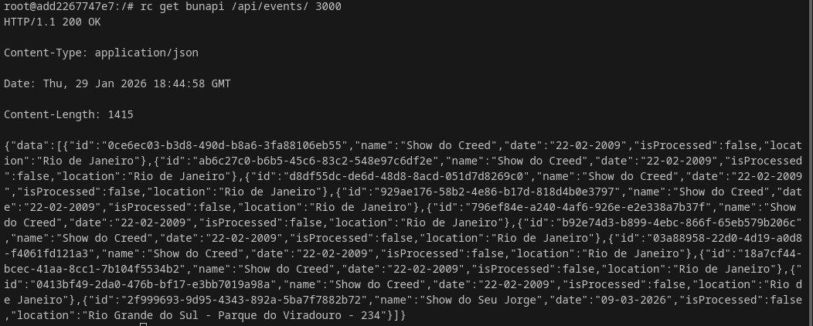
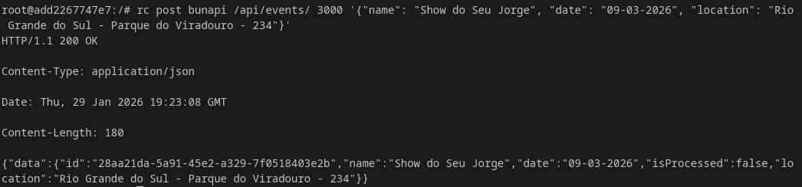
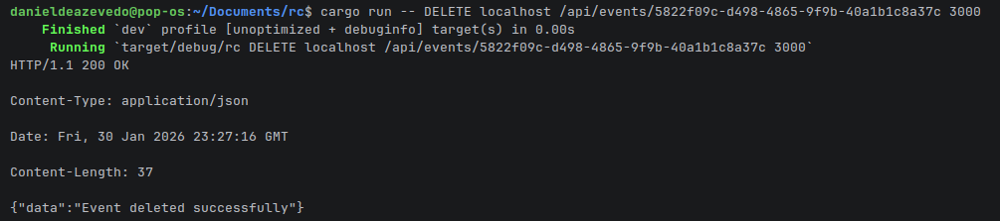

# Rc - Http Client

## Se trata de um simples client-http ainda incompleto com suporte apenas para requisicoes GET/POST

# Tecnologias usadas

[Rust](https://rust-lang.org/) Linguagem Utilizada  
[Docker](https://www.docker.com/) Criacao/Gerenciamento de containers  

# Como testar

## Linux

Instale o Rust (Sera necessario para esta abordagem):
```bash
curl --proto '=https' --tlsv1.2 -sSf https://sh.rustup.rs | sh
```

Clone o repositorio:
```bash
git clone https://github.com/DanielDeAzevedoCordeiro1/Rc---Http-Client.git
```

Acesse o diretorio do projeto:
```bash
cd Rc---Http-Client
```

Este comando fara com que o cargo compile seu projeto em um binario e o insira na pasta ~/.cargo/bin , tornando a manipulacao deste executavel mais facil (execucao global, modificacoes, exclusao):

```bash
cargo install --path .
```

Ao acessar esta pasta (.cargo/bin) sera possivel visualizar o binario gerado:

```bash
cd ~/.cargo/bin
```



Feito isso so testar com o comando:

```bash
rc METODO HOST PATH PORTA BODY
```

## Exemplo de requisicao feita para uma API local(Container Docker)

### GET



### POST



### DELETE

